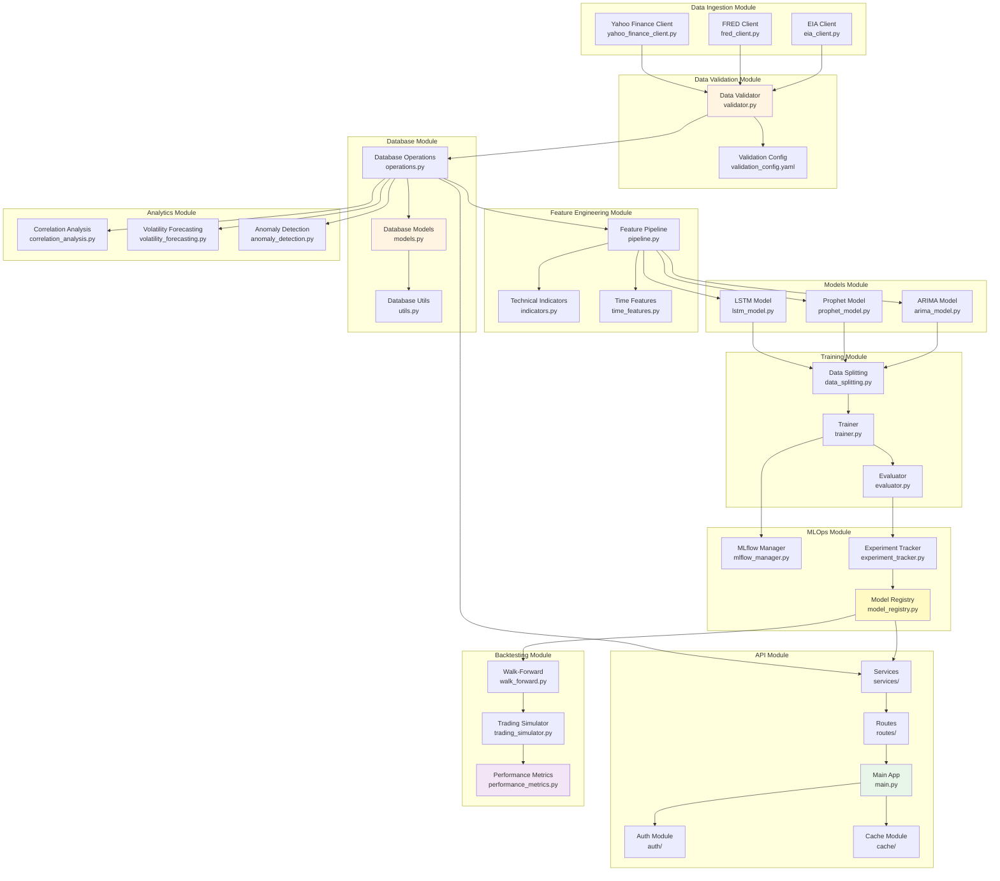
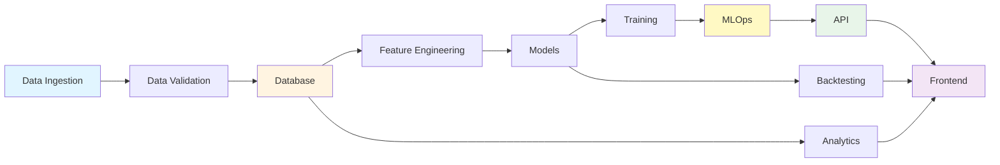
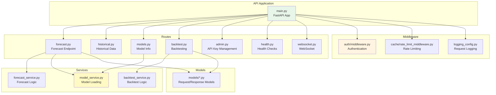

# Component Architecture Diagram

**Version**: 1.0  
**Date**: December 15, 2025  
**Status**: ✅ Complete

---

## Detailed Component Architecture

---

## Module Dependencies

---

## API Component Structure

---

**Last Updated**: December 15, 2025

