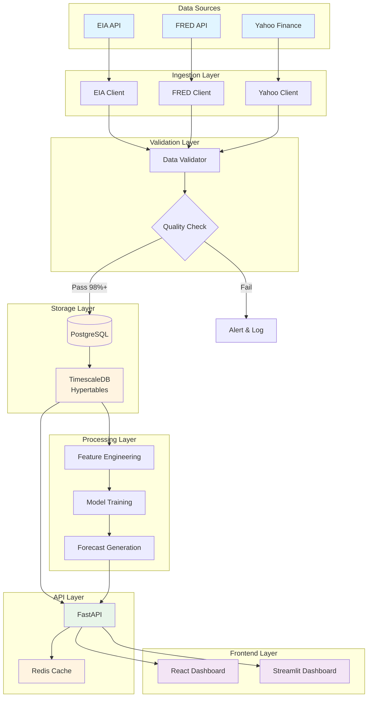
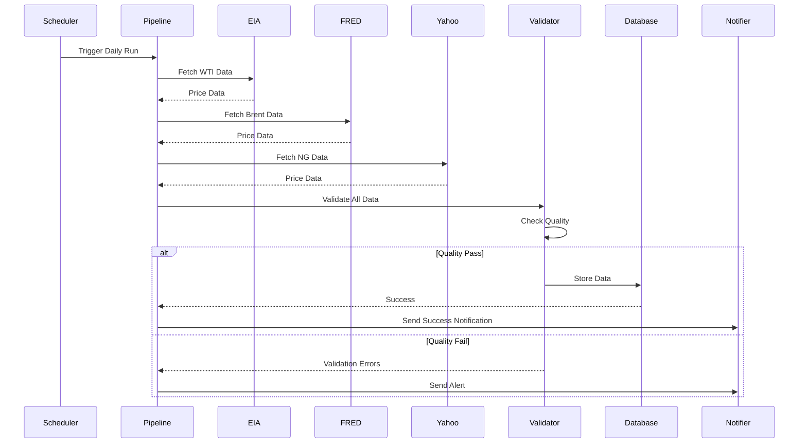
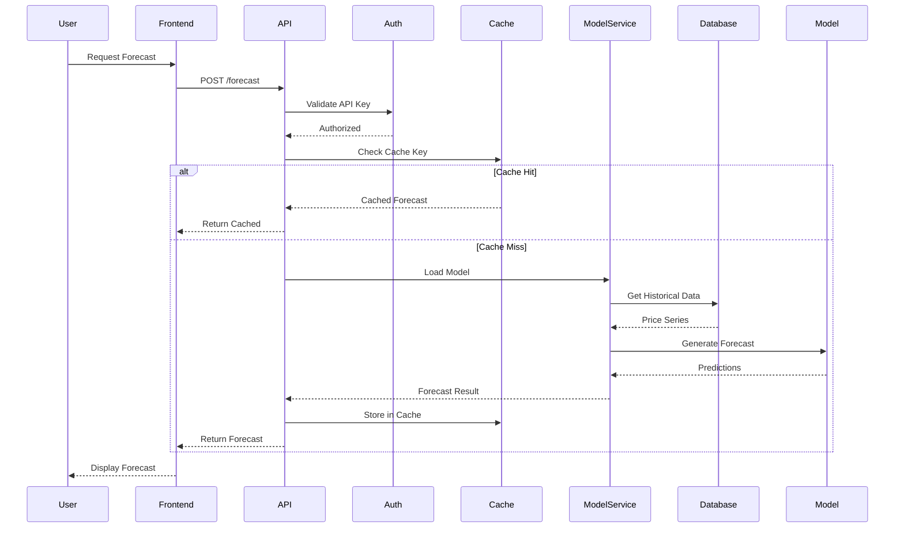
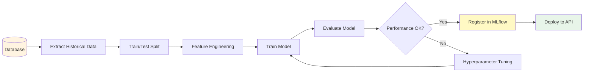

# Data Flow Architecture Diagram

**Version**: 1.0  
**Date**: December 15, 2025  
**Status**: ✅ Complete

---

## Complete Data Flow

---

## Data Pipeline Flow

---

## Forecast Request Flow

---

## Model Training Data Flow

---

**Last Updated**: December 15, 2025

