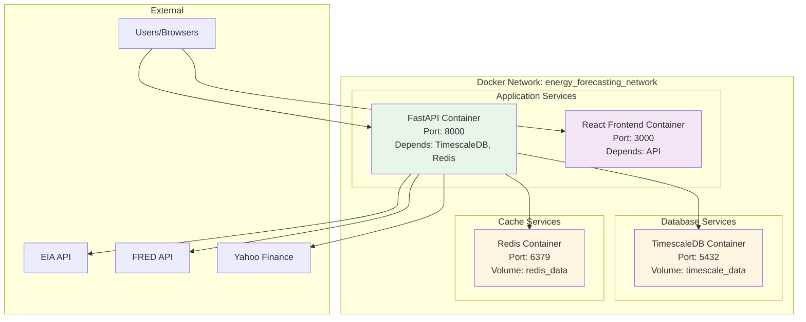
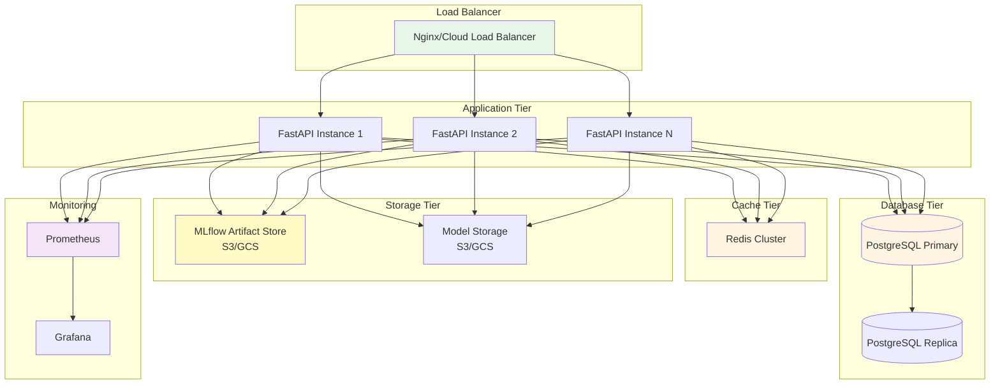
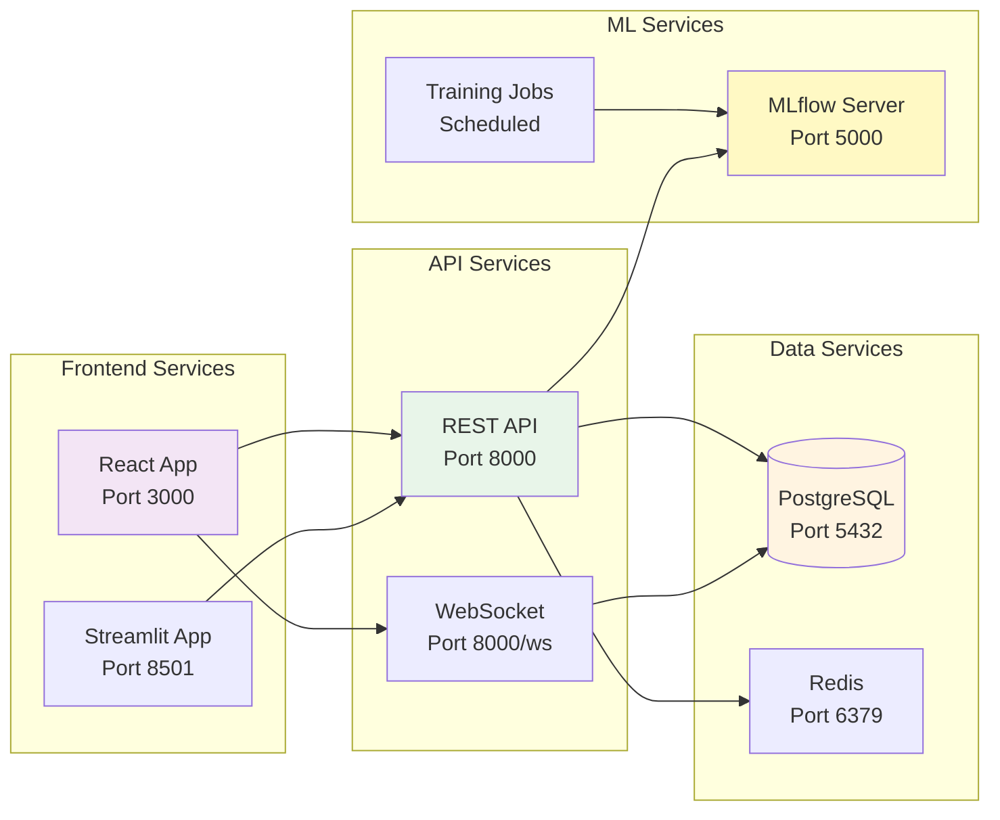

# Deployment Architecture Diagram

**Version**: 1.0  
**Date**: December 15, 2025  
**Status**: ✅ Complete

---

## Docker Compose Deployment

---

## Production Deployment Architecture

---

## CI/CD Pipeline Architecture

```mermaid
flowchart LR
    DEV[Developer] --> GIT[Git Commit]
    GIT --> GITHUB[GitHub Repository]
    GITHUB --> TRIGGER[GitHub Actions Trigger]
    
    TRIGGER --> TEST[Run Tests]
    TEST --> LINT[Lint Code]
    LINT --> BUILD[Build Docker Images]
    BUILD --> SECURITY[Security Scan]
    SECURITY --> PUSH[Push to Registry]
    
    PUSH --> STAGING[Deploy to Staging]
    STAGING --> E2E[E2E Tests]
    E2E --> APPROVAL{Manual Approval}
    
    APPROVAL -->|Approve| PROD[Deploy to Production]
    APPROVAL -->|Reject| ROLLBACK[Rollback]
    
    PROD --> MONITOR[Monitor]
    MONITOR --> ALERT[Alert on Issues]
    
    style TEST fill:#e8f5e9
    style BUILD fill:#fff9c4
    style PROD fill:#e1f5ff
    style MONITOR fill:#f3e5f5
```

---

## Service Communication

---

**Last Updated**: December 15, 2025

