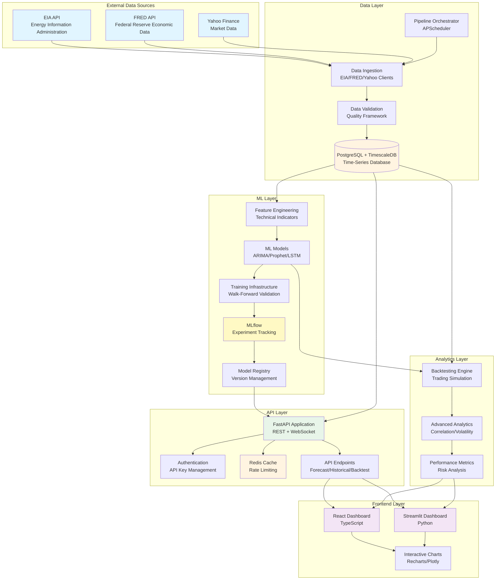
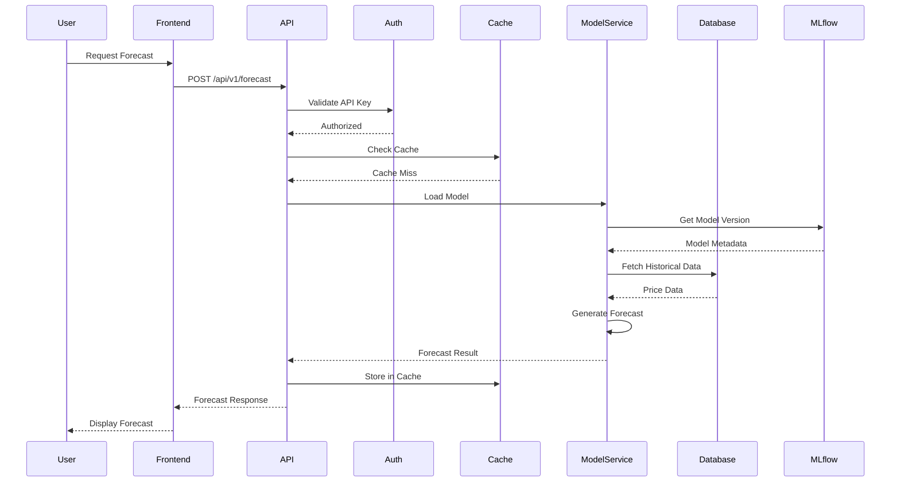
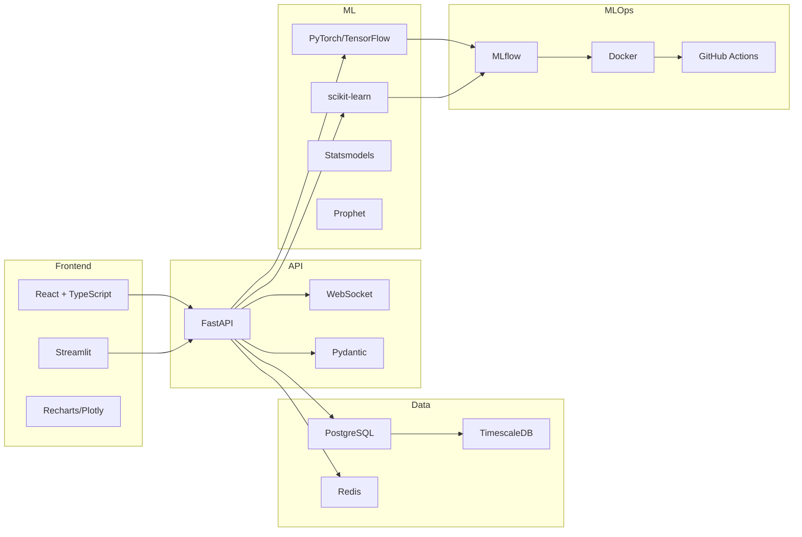
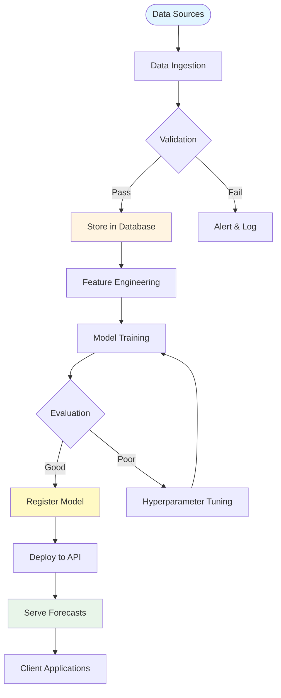

# System Architecture Diagram

**Version**: 1.0  
**Date**: December 15, 2025  
**Status**: ✅ Complete

---

## High-Level System Architecture

---

## Component Interaction Flow

---

## Technology Stack Visualization

---

## Data Flow Architecture

---

**Last Updated**: December 15, 2025

