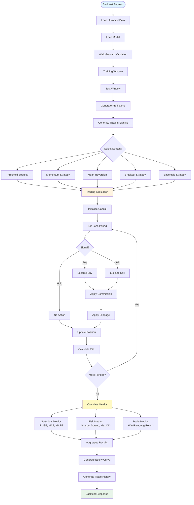
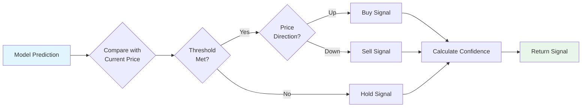
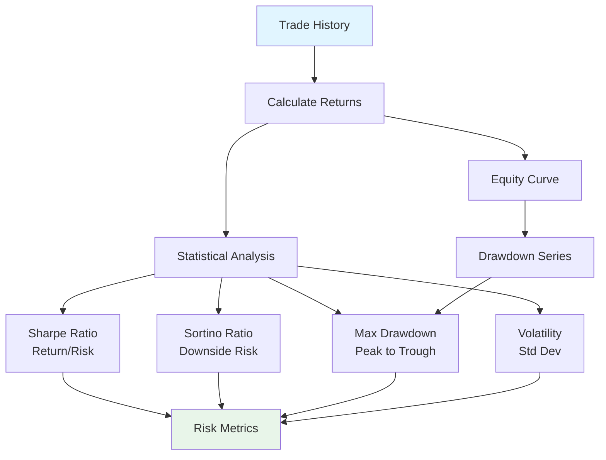
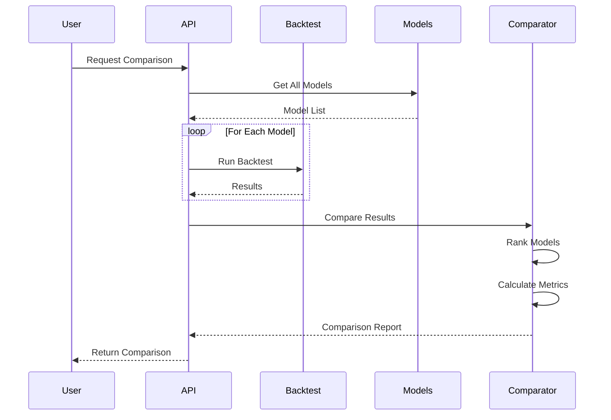

# Backtesting Workflow

**Version**: 1.0  
**Date**: December 15, 2025  
**Status**: ✅ Complete

---

## Backtesting Workflow Diagram

---

## Trading Signal Generation Flow

---

## Risk Metrics Calculation Flow

---

## Model Comparison Workflow

---

**Last Updated**: December 15, 2025

