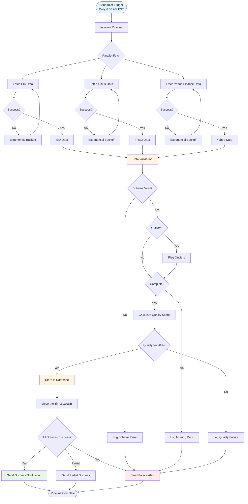
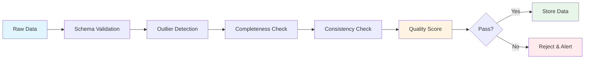
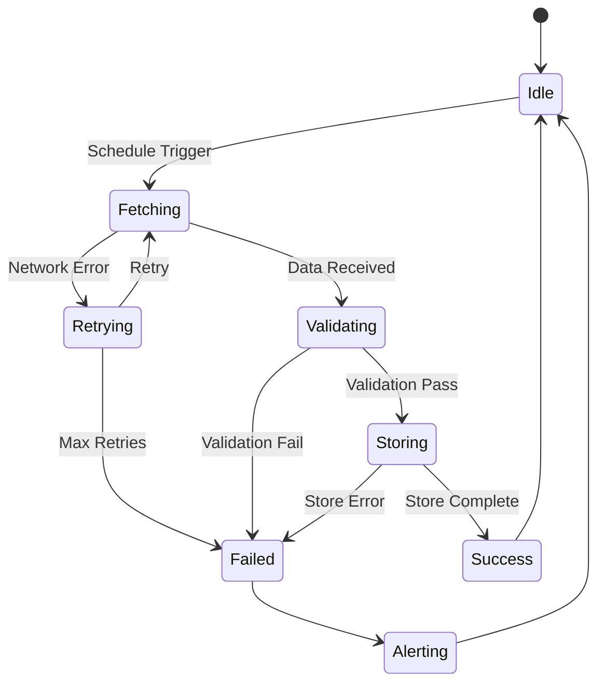

# Data Pipeline Workflow

**Version**: 1.0  
**Date**: December 15, 2025  
**Status**: ✅ Complete

---

## Data Pipeline Workflow Diagram

---

## Data Validation Workflow

---

## Pipeline Error Handling

---

**Last Updated**: December 15, 2025

