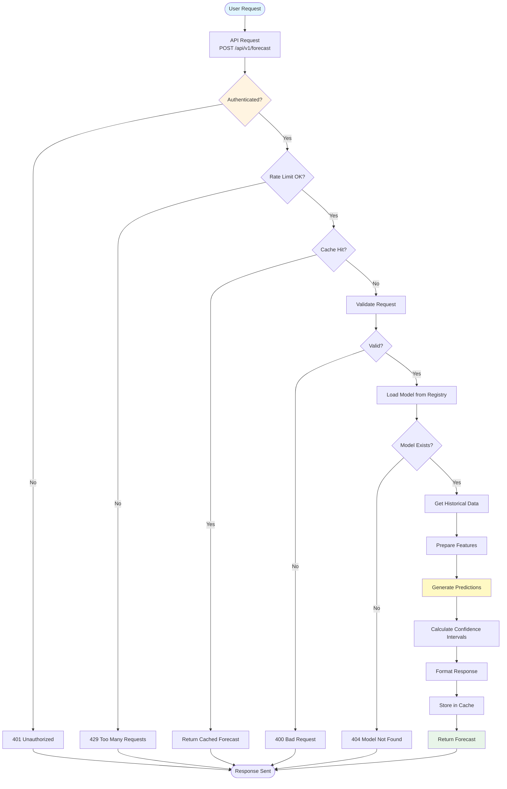
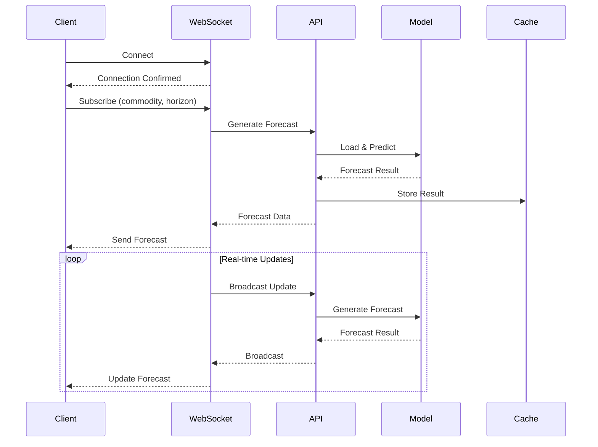
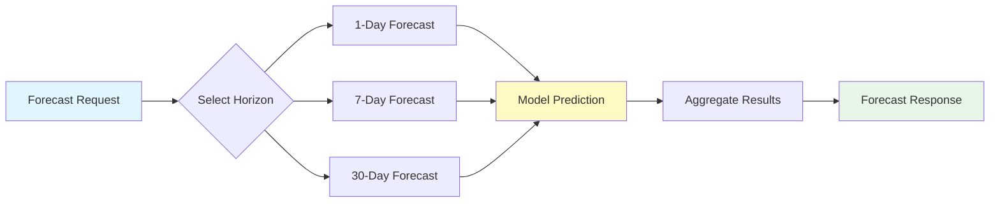

# Forecast Generation Workflow

**Version**: 1.0  
**Date**: December 15, 2025  
**Status**: ✅ Complete

---

## Forecast Generation Workflow

---

## WebSocket Forecast Workflow

---

## Multi-Horizon Forecast Flow

---

**Last Updated**: December 15, 2025

