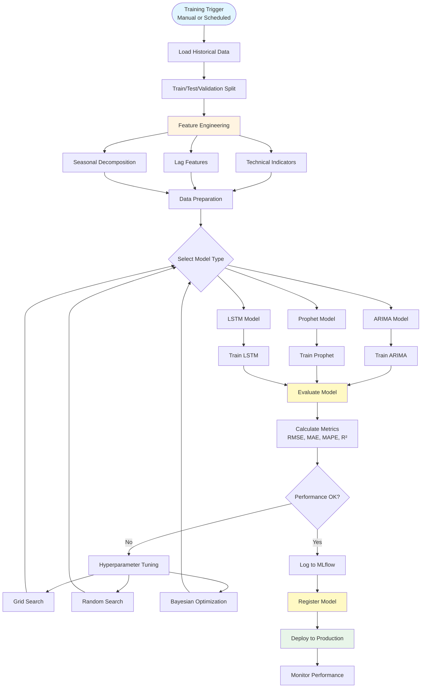
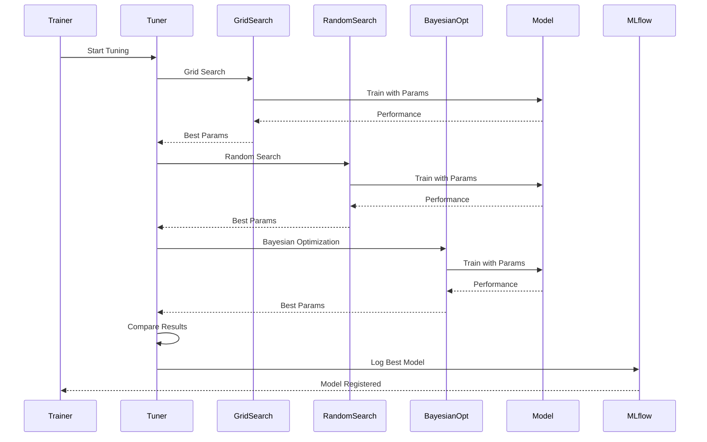
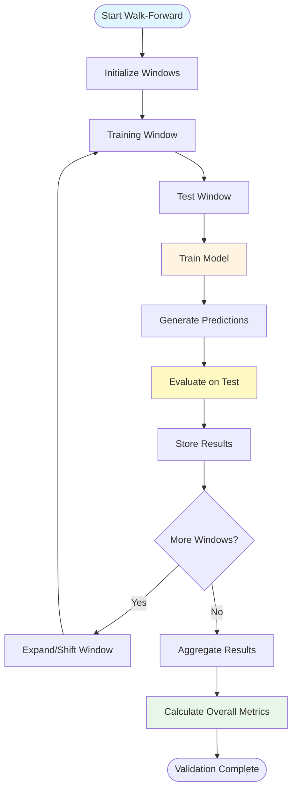
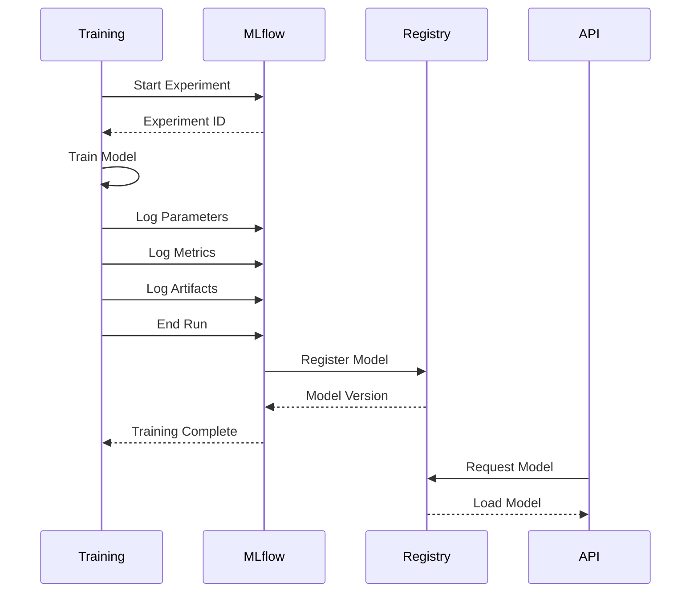

# Model Training Workflow

**Version**: 1.0  
**Date**: December 15, 2025  
**Status**: ✅ Complete

---

## Model Training Workflow Diagram

---

## Hyperparameter Tuning Workflow

---

## Walk-Forward Validation Workflow

---

## MLflow Experiment Tracking Flow

---

**Last Updated**: December 15, 2025

